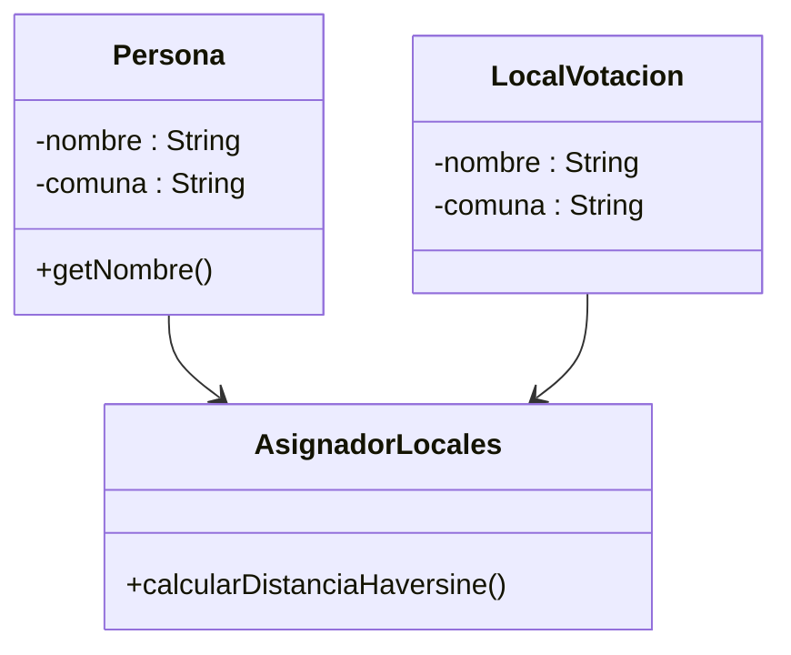

# test-curso

```mermaid
classDiagram
    Persona --> AsignadorLocales
    LocalVotacion --> AsignadorLocales
    class Persona {
        -nombre : String
        -comuna : String
        +getNombre()
    }
    class LocalVotacion {
        -nombre : String
        -comuna : String
    }
    class AsignadorLocales {
        +calcularDistanciaHaversine()
    }

```
